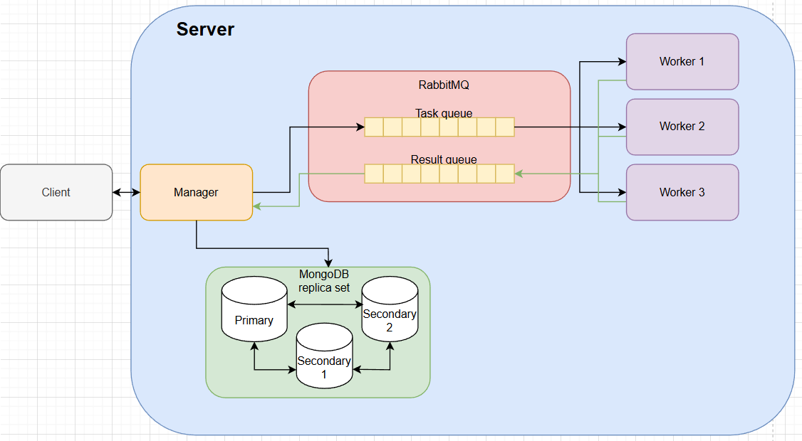

# Распределенные Информационный Системы

## Лабораторная работа №1: Базовая реализация системы CrackHash

Задача: Разработать распределенную систему для взлома MD5-хэшей методом прямого перебора (brute-force) по заданному алфавиту.

Архитектурно система разделена на две части:
1) Manager - принимате задачи от клиента на взлом хэша и управляет процессом их выполнения.
2) Worker - вычислительный узел, который занимается перебором комбинаций и поиском совпадений.

Главная особенность системы в том, что она предоставляет возможность разбить одну большую вычислительную задачу на равные части и распределить её параллельное выполнение на несколько Worker-ов.

## Лабораторная работа №2: Обеспечение отказоустойчивости системы

Задача: Модифицировать систему таким образом, чтобы обеспечить гарантированную обработку запроса пользователя (если доступен менеджер) т.е. обеспечить отказоустойчивость системы в целом.

### Основные требования:

##### 1.Обеспечить сохранность данных при отказе работы менеджера:
   a) Для этого необходимо обеспечить хранение данных об обрабатываемых запросах в базе данных
   b) Также необходимо организовать взаимодействие воркеров с менеджером через очередь RabbitMQ
	   - Для этого достаточно настроить очередь с direct exchange-ем
	   - Если менеджер недоступен, то сообщения должны сохраняться в очереди до момента возобновления его работы
	c) RabbitMQ также необходимо разместить в окружении docker-compose

##### 2. Обеспечить частичную отказоустойчивость базы данных:
   a) База данных также должна быть отказоустойчивой, для этого требуется реализовать простое реплицирование для нереляционной базы MongoDB
   b) Минимально рабочая схема одна primary нода, две secondary
   c) Менеджер должен отвечать клиенту, что задача принята в работу только после того, как она была успешно сохранена в базу данных и отреплицирована

##### 3. Обеспечить сохранность данных при отказе работы воркера(-ов):
   a) В docker-compose необходимо разместить, как минимум, 2 воркера
   b) Организовать взаимодействие менеджера с воркерами через очередь RabbitMQ (вторая, отдельная очередь), аналогично настроить direct exchange
   c) В случае, если любой из воркеров при работе над задачей ”cломался” и не отдал ответ, то задача должна быть переотправлена другому воркеру, для этого необходимо корректно настроить механизм acknowledgement-ов
   d) Если на момент создания задач нет доступных воркеров, то сообщения должны дождаться их появления в очереди, а затем отправлены на исполнение

##### 4. Обеспечить сохранность данных при отказе работы очереди:
   a) Если менеджер не может отправить задачи в очередь, то он должен сохранить их у себя в базе данных до момента восстановления доступности очереди, после чего снова отправить накопившиеся задачи
   b) Очередь не должна терять сообщения при рестарте (или падении из-за ошибки), для этого все сообщения должны быть персистентными (это регулируется при их отправке)

## Схема системы:
